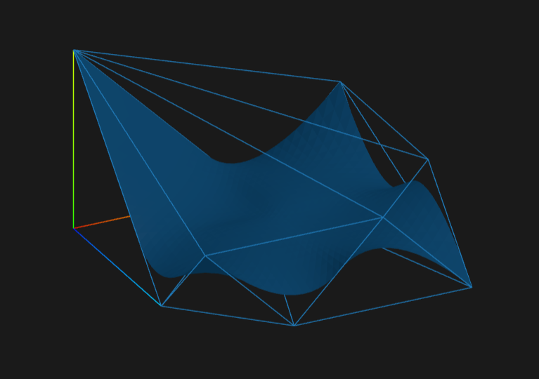
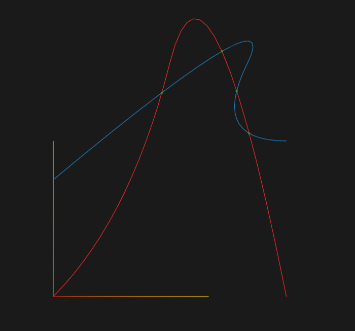

# Geop 2

<iframe src="https://github.com/sponsors/TobiasJacob/button" title="Sponsor TobiasJacob" height="32" width="114" style="border: 0; border-radius: 6px;"></iframe>

Geop 2 is an open source CAD kernel developed by me (Tobias Jacob). Contributions are welcome, but will requrie a contributor license agreement (CLA). Sponsoring is also more than welcome. It is the successor to [Geop](https://github.com/TobiasJacob/geop), which worked as a proof of concept. Take a look also at [Isotope](https://github.com/CADmium-Co/ISOtope), a high-performance sketch constraint solver. I use some lessons learned from Geop to build a more robust and feature-rich kernel. Here are some of the key lessons learned:
- I ditched math heavy algorithms in favor of subdivions schemes. Take a look at this interactive  
[Subdivision Demo](https://tobiasjacob.github.io/geop2/curve_curve_intersection/scene_0.html).
- The project is NURBS first. Once intersections, boolean operations, fillets, etc. are working well for NURBS, one can convert other geometric entities like planes or spheres to nurbs.
- For debugging, I am still rendering everything into a book, but now I render to html instead of pngs.

## Roadmap
- [x] NURBS curves and surfaces
- [x] Convex hulls decomposition and intersection
- [x] Subdivion schemes
    - [x] Curve subdivision
    - [x] Surface subdivision
- [ ] Intersections
    - [x] Curve-curve intersections
    - [ ] Curve-surface intersections
    - [ ] Surface-surface intersections
- [ ] Boolean operations
- [ ] Fillets and Chamfers
- [ ] Sketch constraint solver
- [ ] Export to STEP
- [ ] Export to STL

## Demos

Demos can be generated by running `cargo test`

[Link to Convex Hull Demo](https://tobiasjacob.github.io/geop2/nurbs_surface.html)

[Intersection results](https://tobiasjacob.github.io/geop2/curve_curve_intersection.html)

[Subdivision Steps](https://tobiasjacob.github.io/geop2/curve_curve_intersection/scene_0.html)

[Link to Subdivision Demo 1](https://tobiasjacob.github.io/geop2/nurbs_surface_subdivide_level_1.html)

[Link to Subdivision Demo 2](https://tobiasjacob.github.io/geop2/nurbs_surface_subdivide_level_2.html)

[Link to Subdivision Demo 3](https://tobiasjacob.github.io/geop2/nurbs_surface_subdivide_level_3.html)
